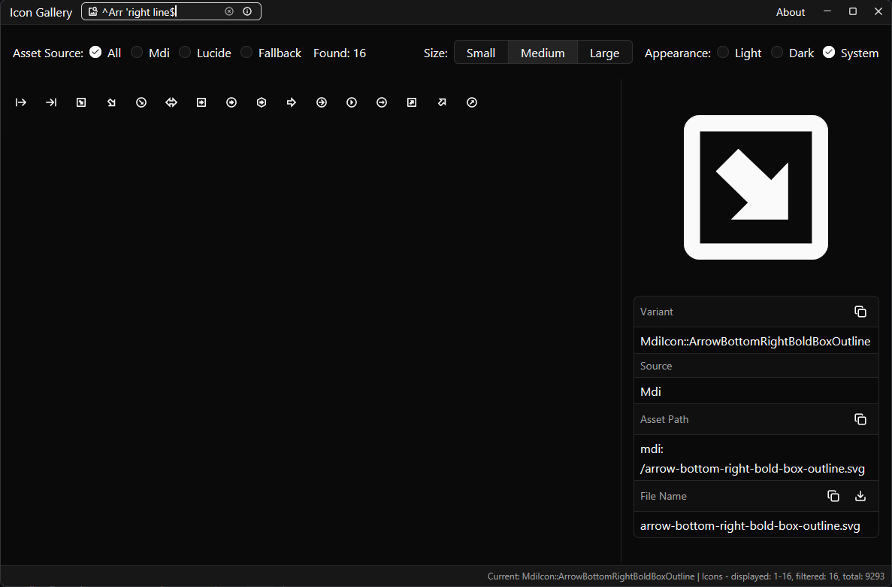

# gpui-assets

A Cargo workspace for building desktop applications with [Zed GPUI](https://github.com/zed-industries/zed) and [gpui-component](https://github.com/longbridge/gpui-component). It provides a modular asset-management layer, an embedded Lucide icon set, and reusable UI examples.



The `example-gallery` application demonstrates the workspace in action: a searchable, filterable grid of icons from every registered source with a right-side info panel for copying names, paths, SVG content, and downloading individual icons.

## Workspace Structure

```
gpui-assets/
├── Cargo.toml                 # Workspace definition and shared dependencies
├── crates/
│   ├── assets/                # Universal asset-source registry (AssetsRegistry)
│   ├── macros/                # Proc-macros (icon_named!)
│   ├── lucide/                # Embedded Lucide icons + generated icon enum
│   └── mdi/                   # Embedded Material Design Icons + generated icon enum
├── examples/
│   ├── example-assets/        # Minimal GPUI window example
│   └── example-gallery/       # Gallery of icons from all sources with search and source filter
└── README.md / AGENTS.md
```

## Crates

| Crate | Description |
|-------|-------------|
| `gpui-assets` | `AssetsRegistry` — a registry of `AssetSource`s with prefix routing and global fallback. |
| `gpui-assets-macros` | `icon_named!` proc-macro that generates an `IconNamed` enum from a directory of SVGs. |
| `gpui-lucide` | `LucideAssets` (RustEmbed-based `AssetSource`) and `LucideIcon` enum for bundled icons. |
| `gpui-mdi` | `MdiAssets` (RustEmbed-based `AssetSource`) and `MdiIcon` enum for bundled Material Design Icons. |
| `example-assets` | Runnable example showing `AssetsRegistry` + `IconName::ArrowRight` + `LucideIcon::Table`. |
| `example-gallery` | Gallery that renders icons from all bundled sources (Lucide, MDI, fallback) with search, source filter, theme/size controls, and a right-side info panel for copy/download actions. |

## Quick Start

Build the workspace:

```bash
cargo build --workspace
```

Run the examples:

```bash
cargo run -p example-assets
cargo run -p example-gallery
```

Run tests:

```bash
cargo test --workspace
```

> On Windows, real-time antivirus scanners may lock freshly-built test binaries. If `cargo test` fails with access-denied errors, set an alternate target directory:
> ```bash
> CARGO_TARGET_DIR=/tmp/gpui-test-target cargo test --workspace
> ```

## Using Icons

```rust
use gpui_component::Icon;
use gpui_lucide::icons::LucideIcon;

Icon::new(LucideIcon::Pin);
```

To wire assets into a GPUI application:

```rust
use gpui_assets::AssetsRegistry;
use gpui_lucide::LucideAssets;
use gpui_mdi::MdiAssets;

let assets = AssetsRegistry::new()
    .use_source(LucideAssets)
    .use_source(MdiAssets)
    .fallback(gpui_component_assets::Assets);

let app = gpui_platform::application().with_assets(assets);
```

## Adding a New Prefixed Asset Source

The `gpui-lucide` and `gpui-mdi` crates demonstrate the full pattern for adding a bundled asset source with a routing prefix. To create another one (for example, `heroicons`):

1. **Add the assets** — create `assets/heroicons/icons/` and place the SVG files there.
2. **Create a crate** at `crates/heroicons/` and add it to `[workspace.members]` in the root `Cargo.toml`.
3. **Implement `AssetSource`** using `RustEmbed`:

   ```rust
   use std::borrow::Cow;
   use gpui::{AssetSource, Result, SharedString};
   use rust_embed::RustEmbed;

   pub const HEROICONS_PREFIX: &str = "heroicons";

   #[derive(RustEmbed)]
   #[folder = "../../assets/heroicons/icons"]
   #[include = "*.svg"]
   pub struct HeroiconsAssets;

   impl AssetSource for HeroiconsAssets {
       fn load(&self, path: &str) -> Result<Option<Cow<'static, [u8]>>> {
           let path = path.strip_prefix('/').unwrap_or(path);
           Ok(HeroiconsAssets::get(path).map(|file| file.data))
       }

       fn list(&self, path: &str) -> Result<Vec<SharedString>> {
           let prefix = path.strip_prefix('/').unwrap_or(path);
           Ok(HeroiconsAssets::iter()
               .filter(|p| p.starts_with(prefix))
               .map(SharedString::from)
               .collect())
       }
   }
   ```

4. **Generate the icon enum** with `icon_named!`:

   ```rust
   use gpui::{IntoElement, RenderOnce};
   use gpui_assets_macros::icon_named;
   use gpui_component::IconNamed;

   icon_named!(
       HeroiconsIcon,
       "heroicons",
       "../../assets/heroicons/icons",
       [Debug, Copy, PartialEq, Eq]
   );

   impl RenderOnce for HeroiconsIcon {
       fn render(self, _: &mut gpui::Window, _cx: &mut gpui::App) -> impl IntoElement {
           gpui_component::Icon::new(self)
       }
   }
   ```

5. **Implement `PrefixedAssetSource`** so the source knows its own prefix:

   ```rust
   use gpui_assets::PrefixedAssetSource;

   impl PrefixedAssetSource for HeroiconsAssets {
       fn default_prefix() -> &'static str {
           HEROICONS_PREFIX
       }
   }
   ```

6. **Re-export** the prefix, `AssetSource` struct, and `icons` module from `src/lib.rs`.
7. **Register** the source with `AssetsRegistry`:

   ```rust
   use gpui_assets::AssetsRegistry;
   use gpui_heroicons::HeroiconsAssets;

   let assets = AssetsRegistry::new()
       .use_source(HeroiconsAssets)
       .fallback(gpui_component_assets::Assets);
   ```

The generated icon enum implements `IconNamed`, so each variant maps to a prefixed path like `heroicons:/arrow-right.svg`. `AssetsRegistry` routes such paths to the registered source and forwards unprefixed paths to the fallback. `use_source` is shorthand for `.use_prefix(HEROICONS_PREFIX, HeroiconsAssets)`.

See `crates/lucide/` and `crates/mdi/` for complete working examples, and `AGENTS.md` for the full step-by-step agent guide.

## Adding Icons

Drop new `.svg` files into the `icons/` folder of any existing source (e.g. `assets/lucide/icons/` or `assets/mdi/icons/`). The `icon_named!` macro regenerates the corresponding enum at compile time, so the new icon is immediately available as `LucideIcon::{PascalCaseName}` or `MdiIcon::{PascalCaseName}`.

## Dependencies

All dependencies are declared in the root `Cargo.toml` under `[workspace.dependencies]` and referenced via `{ workspace = true }` in member crates.

Key dependencies:

- `gpui` — Zed's GPU-accelerated UI framework (git).
- `gpui_platform` — Platform backend for `gpui` (git).
- `gpui-component` — Component library for GPUI (git).
- `gpui-component-assets` — Default bundled assets for gpui-component (git).
- `rust-embed` — Compile-time asset embedding.

## License

MIT OR Apache-2.0
